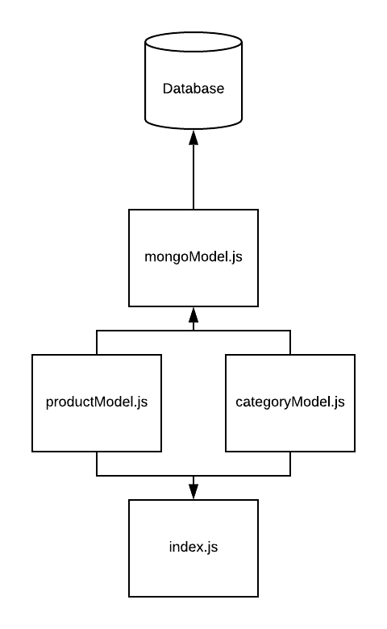

# LAB - 05

## Mongo Data Model

### Author: David Vloedman

### Links and Resources
* [submission PR](https://github.com/david-vloedman-401-advanced-javascript/401-lab-05/pull/1)
* [travis](https://www.travis-ci.com/david-vloedman-401-advanced-javascript/401-lab-05)

#### Documentation

* [JSDoc Index](./docs/index.html)

### Setup

* npm install

#### `.env` requirements (where applicable)

* `MONGODB_URI` - URL to the running mongo instance/db

#### How to initialize/run your server app (where applicable)

* npm start
  
#### Tests

* npm test

#### UML

